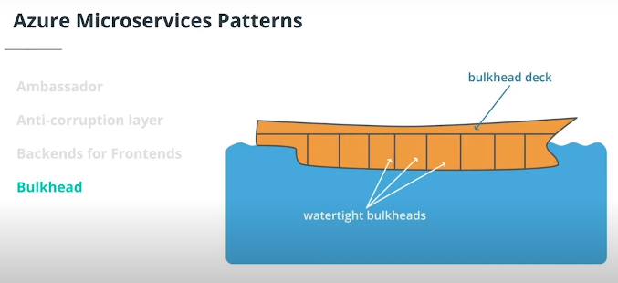

# Azure Microservices
Microsoft Azure's microservices offerings can be broken down into two major categories:

* Serverless architectures using functions as a service (FaaS)
* Service orchestrators managing services on dedicated nodes, such as Virtual Machines

Serverless Options
* Azure Functions is Microsoft's serverless compute option. This will be the main topic of the next lesson.
* Azure Event Grid is another option, but for event routing service. This will be covered two lessons from now.

Service Orchestrator Option
Orchestrators manage the deployment of services, such as monitoring services health, rebooting dead services, balancing network traffic, scaling instances, etc.

Azure offers the following orchestrator options:

Note: Kubernetes has overtaken Service Fabric as the de facto orchestration solution for microservices, so our course will cover AKS instead of Service Fabric. AKS is a better option for our Linux-based containers for Python applications. You are more likely to encounter Kubernetes in the field, as opposed to Service Fabric.

## Microservices Design Patterns

An Ambassador is a helper service to negotiate connectivity-related requests from outside clients to internal services. You would not want the services to individually deal with tasks like monitoring, logging, routing, and authentication.

An Anti-corruption Layer is a service to deal with different versions of the same application, by acting as a façade between new and legacy applications.

Back-ends for front-ends create separate backend services for clients to consume. It is possible to have multiple clients, or a single client using your backend services. For our final project and the exercises throughout the course, this is the main architectural pattern we will use, mainly because it is extremely common.

For Bulkhead patterns, we are concerned with minimizing failures by making sure all services are available by isolating important resources. This use case is important in connection pools and handling multi-thread requests.

Other useful patterns are:
 
Gateway Aggregation Pattern

> Use a gateway to aggregate multiple individual requests into a single request. This pattern is useful when a client must make multiple calls to different backend systems to perform an operation.

## Compute Options for Azure Microservices
Microsoft Azure has created a great flowchart to outline your compute options for different use cases. If you follow the tree below, you can see that we are following the path of:

## Compare Cost Options

