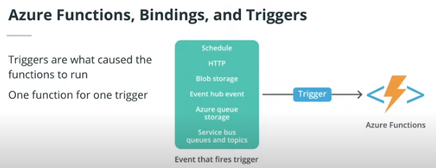
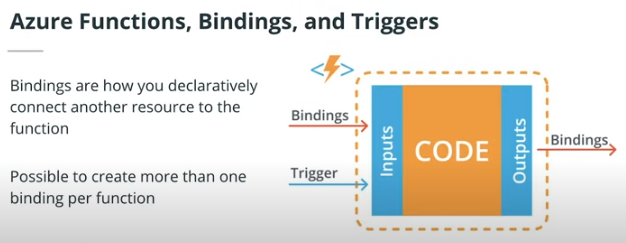

# What are Azure Functions?
Azure Functions is a serverless, event-driven, compute-on-demand platform. If you are coming from AWS, you might think this is similar to AWS Lambda, and you are correct.

In summary,

* Azure Functions let you run bits of codes to process an event
* It's not necessary for developers to manage the infrastructure
* All Functions have triggers
* It's great for building APIs and microservices (the purpose of this class)
* Other use cases include bulk-data processing, integrating systems, and supporting IoT (outside the scope of this class)

Supported Languages
> You can use any of the following languages to run Azure Functions: C#, Java, JavaScript, Python, and PowerShell.

## Azure Bindings and Triggers
How does each service endpoint know when it is time to implement their code? They do this through triggers.

Triggers are what cause a function to run. Each Azure Function can support different types of event triggers. There are many types of triggers, but the most common ones are:

* HTTP triggers
* Time triggers
* Event Hub triggers
* Blob storage triggers
* Queue triggers

Triggers come with associated data, which usually are the provided payload of the function. It’s important to know that there is a one-to-one relationship with triggers and functions. That means there is only one function for one trigger.

### Azure Functions Bindings

Bindings are how you declaratively connect another resource to the function. In bindings, you can declare inputs and outputs as parameters to the functions. Unlike triggers, you can use multiple bindings for a function. For example, you can create a binding that tells Azure Functions: "Hey, I have some parameters from my database that I want you to map into the function".

All triggers and bindings have a direction property. Triggers can only do input directions while bindings can support both input and outputs. With the exception of Azure Functions written in C# language, all the bindings are accessible in the function.json file. Since we are using Python, you can expect to see the bindings in function.json file as well.

### Azure Functions Templates
Azure Functions already have the following templates, along with preset triggers and functions:

* HTTP: Code triggered by HTTP requests
* Timer: Code triggered by periodic, scheduled events
* Azure Cosmos DB: create and update your Azure Cosmos DB database
* Blob storage: create and update Azure Storage blobs
* Queue storage: process Azure Storage queue messages
* Event Grid: process Azure Event Grid events by the use of subscriptions and filters
* Event Hub: process large volumes of Event Hub events
* Service Bus Queue: process Service Bus queue messages and integrate to Azure or on-premises services
* Service Bus Topic: similar to Service Bus Queue, but process topic messages instead

# Links
[resource-1](https://docs.microsoft.com/en-us/learn/paths/create-serverless-applications/?WT.mc_id=udacity_learn-wwl)

[resource-2](https://docs.microsoft.com/en-us/learn/modules/create-serverless-logic-with-azure-functions/?WT.mc_id=udacity_learn-wwl)

[resource-3](https://docs.microsoft.com/en-us/learn/modules/develop-test-deploy-azure-functions-with-core-tools/?WT.mc_id=udacity_learn-wwl)

[resource-3](https://docs.microsoft.com/en-us/learn/modules/develop-test-deploy-azure-functions-with-visual-studio/?WT.mc_id=udacity_learn-wwl)