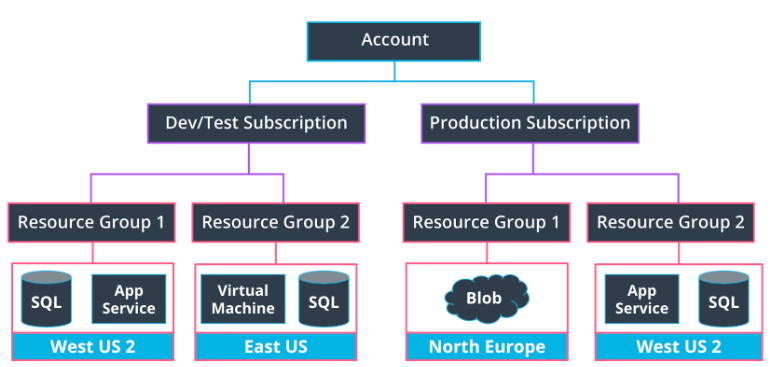

# Subscription and Resource Groups
Azure uses a hierarchical system to keep resources organized and to manage expenses easily.

This starts at the top with your Azure Account. The next level down is the Subscription level; in this course you will likely only work with one subscription, but it's likely in your day-to-day Azure work that you may be working with more than one. For instance, there may be one subscription for development and testing, and another for production systems.

Below the subscription level is where you'll find Resource Groups. These help to organize resources you use, such as Virtual Machines and App Services (as well as storage options and other resources we'll discuss in later lessons), in order to make resource management easier. You may have a resource group for a specific project, or because resource groups are tied to a Region, you may have resource groups containing similar resources in multiple locations across the world. A region contains at least one data center, but could have multiple data centers that are close by and networked together through a low-latency network. There are over 60 regions available worldwide and available in 140 countries, such as East US and Japan West.

When choosing a region, it's important to consider what you are trying to achieve. For development and testing purposes, you likely want a region close to yourself; for production purposes, you often want resources to be close to your user. Keep the following in mind:

* Service availability - Some services may not be available in a particular region.
* Performance - Latency determines network service performance; are you creating resources for yourself or your end user?
* Cost - Costs of services vary by region. If latency isn’t an issue, you might want to deploy your services in the cheapest region.

# Azure Compute Services
* Virtual Machines
* App Service & App Service Plan    
* Azure Batch
* Azure Functions
* Container Instances
* Service Fabric
* Azure Kubernetes Service (AKS)

## Virtual Machines
Azure Virtual Machines (VMs) provide infrastructure as a service (IaaS) by allowing you to create and use virtual machines in the cloud.

Some of the benefits of VMs are:

* VMs allow you full access and control of the VM.
* Lower up-front cost compared to purchasing and maintaining hardware.
* Support of both Linux and Windows VMs.
* Multiple types to choose from, such as compute or memory-optimized VMs, along with varying amounts of CPU, RAM and storage.
* VMs allow for the installation of custom images and are an excellent choice for migrating from an on-premises server to the cloud.
* Multiple VMs can be grouped to provide high availability, scalability, and redundancy. There are two options when it comes to scaling—Virtual Machine Scale Sets and Load Balancers.

Some of the limitations of VMs are:
* They are more expensive
* They can be more time consuming for the developer than other compute options

## App Service
Azure App Service is an HTTP-based service for hosting web applications, REST APIs, and mobile back ends. It is a Platform as a Service (PaaS) that allows a developer to focus on the application while Azure takes care of the infrastructure.

Some of the benefits of using an App Service are:
* Support of multiple languages, such as .NET, .NET Core, Java, Ruby, Node.js, PHP, or Python
* High availability, auto-scaling and support of both Linux and Windows environments.
* Continuous deployment model using GitHub, Azure DevOps, or any Git repo.
* Vertical or Horizontal scaling. Vertical scaling increases or decreases resources allocated to our App Service, such as the amount of vCPUs or RAM, by changing the App Service pricing tier. Horizontal scaling increases or decreases the number of Virtual Machine instances our App Service is running.
* You can set the amount of hardware allocated to host your application, and cost varies based on the plan you choose. There are three different tiers - Dev/Test, Production, and Isolated. We’ll be using the free option within Dev/Test for the exercises in this course.

Some of the limitations of an App Service are:
* You have limited access to the host server, so you are unable to control the underlying OS or install software on the server.
* You’re always paying for the service plan, even if your services or application isn’t running.
* There are hardware limitations, such as a maximum of 14GB of memory and 4 vCPU cores per instance
* While they support multiple languages, as noted in the benefits above, they are limited to just using those languages (as of when this course was built).

# Storage Services
* Azure SQL Server and SQL Database
* Azure Blob Storage
* Azure CosmosDB
* Disk Storage
* Azure Data Lake Storage
* HPC Cache